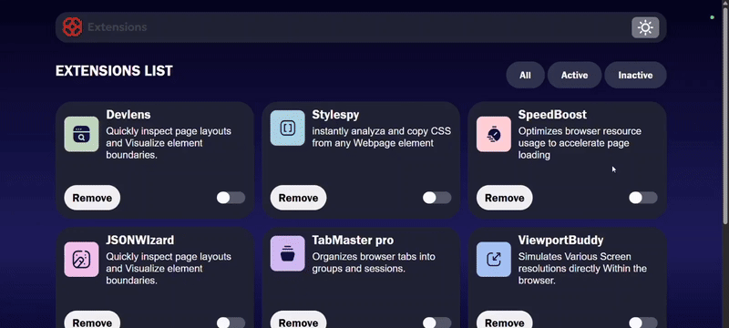

# 🚀 Extensions Dashboard

A responsive and interactive **Extensions Management Dashboard** built with **HTML, CSS, and JavaScript**.  
This project demonstrates a modern UI/UX design with **dark/light mode toggle**, **filtering system (All / Active / Inactive)**, and **dynamic extension controls**.

---
---

## 🚀 Live Demo

👉 [Click here to view the project](https://raviranjanmishra01.github.io/HTML-CSS-AND-JS_projects/01-browser-extensions-manager-ui-main/)

---

# 📸 Preview




---

## ✨ Features

- 🎨 **Dark/Light Mode Toggle** with smooth transitions  
- 🧩 **Interactive Extension Cards** with activation/inactivation switch  
- 🔎 **Filter Options** – View All, Active, or Inactive extensions  
- 🗑️ **Remove Extension** functionality with instant DOM updates  
- 📱 **Fully Responsive Design** for desktop, tablet, and mobile  
- ⚡ **Smooth Animations & Hover Effects** for better user experience  

---

## 🛠️ Tech Stack

- **HTML5** – Semantic structure  
- **CSS3 (SCSS-style nesting)** – Responsive layout, modern styling  
- **Vanilla JavaScript (ES6)** – Theme toggle, filtering, and interactions  

---

## 📂 Project Structure

```bash
.
├── assets/
│   ├── images/              # All icons and logos
│   │   ├── logo-white.svg
│   │   ├── icon-sun.svg
│   │   ├── icon-moon.svg
│   │   └── ...other icons
│   └── ...
├── index.html               # Main HTML file
├── style.css                # Stylesheet
├── script.js                # JavaScript logic
└── README.md                # Project documentation
```

🚀 Usage

> Switch Theme → Click the 🌙/☀️ icon in the navbar

> Filter Extensions → Use the buttons: All, Active, Inactive

> Activate/Deactivate → Toggle the round switch on each card

> Remove Extension → Click the Remove button on a card

## 📱 Responsiveness

- > 🖥️ Desktop (≥1288px) → Grid layout with 3 columns

- > 💻 Tablet (≤950px) → Grid layout with 2 columns

- > 📱 Mobile (≤650px) → Single-column stacked cards

# 👨‍💻 Author

Developed with ❤️ Raviranjan kumar
